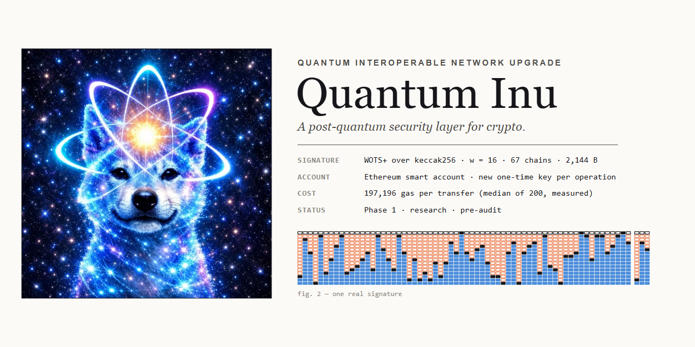

<p align="center">
  
</p>

<h1 align="center">Quantum Inu</h1>

<p align="center">
  <strong>Quantum Interoperable Network Upgrade</strong><br>
  <sub>A post-quantum authorization and migration layer for crypto infrastructure.</sub>
</p>

<p align="center">
  <code>Ethereum-native</code> ·
  <code>Hash-based authorization</code> ·
  <code>One-time key rotation</code> ·
  <code>Hybrid migration</code> ·
  <code>Research / pre-audit</code>
</p>

---

## Overview

Most major blockchain systems still authorize transactions with classical elliptic-curve signatures. Ethereum and Bitcoin rely heavily on ECDSA over secp256k1, while Solana uses Ed25519. These schemes are efficient and widely deployed, but they were not designed for a world in which cryptographically relevant quantum computers exist.

**Quantum Inu** is a research implementation for moving account authorization toward post-quantum security without pretending that a single smart contract can make an entire blockchain quantum-resistant.

The current implementation focuses on a practical first layer:

- post-quantum authorization for an Ethereum smart account;
- WOTS+ signatures built from `keccak256`;
- one-time key rotation committed on-chain;
- replay and redirection resistance at the account layer;
- optional hybrid ECDSA + post-quantum authorization;
- reproducible gas measurements from local-chain execution;
- explicit separation between account-layer protection and consensus-layer migration.

The long-term direction is broader: exposed-key monitoring, migration tooling, standardized post-quantum schemes, and chain-specific adapters for Ethereum, Bitcoin and Solana.

> **Status:** Phase 1 research implementation. Pre-audit. Not suitable for production funds.

---

## 01 — The authorization path

A Quantum Inu account does not treat the relayer as an authority.

The relayer may submit the transaction and pay gas, but authorization comes from the signature material generated by the wallet. Every operation commits to the next one-time public key hash, which means the account advances its authorization state before control is passed to the target.

<p align="center">
  
</p>

### Operation lifecycle

The sequence above captures the entire authorization path:

1. The wallet reads the current account `nonce` and `keyHash`.
2. It derives the current and next one-time WOTS+ keys.
3. It builds an operation digest over the chain, account, nonce, call target, value, calldata hash and next key hash.
4. The wallet signs that digest using the current one-time key.
5. A relayer submits the operation.
6. `QuantumInuAccount` reconstructs the WOTS+ hash chains and verifies the signature against the stored `keyHash`.
7. The account advances the nonce and replaces the current key hash with the committed next key hash.
8. Only after the authorization state is updated does the target call execute.

A failed target call reverts the whole operation. Invalid signatures, stale nonces, invalid next keys and malformed authorization material are rejected before funds can move.

### Digest binding

The operation digest binds:

```text
chainId
account
nonce
target
value
keccak256(calldata)
nextKeyHash
```

That binding is important. A signature produced for one account, target, call or nonce should not be reusable for another authorization context.

---

## 02 — Inside one QINU-WOTS-K256 signature

The current Phase 1 scheme is deliberately simple at the cryptographic primitive level.

Instead of implementing a new post-quantum primitive inside the EVM, Quantum Inu uses a **Winternitz one-time signature construction over `keccak256`**.

<p align="center">
  
</p>

The diagram is the useful part of the design because it makes the verifier work visible.

For `w = 16`, the signer and verifier divide the same hash-chain work:

- the signer starts from a secret chain value;
- it hashes forward to the digit represented by the operation digest;
- the published signature exposes that intermediate value;
- the EVM hashes from that point to the end of the chain;
- the reconstructed chain endpoints are compressed and compared with the stored public-key hash.

The current profile uses:

| Parameter | Value |
|---|---:|
| Construction | QINU-WOTS-K256 |
| Hash | `keccak256` |
| Winternitz parameter | `w = 16` |
| Chains | `67` |
| Signature size | `2,144 bytes` |
| Stored account key material | `32-byte key hash` |
| Key usage | One operation per key |

The signature is large compared with classical signatures, but the account stores only the compact commitment to the active one-time key.

---

## 03 — Why gas moves with verifier work

WOTS+ does not have a constant verification cost for every digest.

The amount of work performed by the EVM depends on how far each revealed chain element is from the end of its corresponding hash chain.

That relationship is visible in the measured local-chain data.

<p align="center">
  
</p>

For the measured run shown above:

```text
sample size                200 operations
median transfer gas        197,196
observed range             185,385 — 220,770
verifier relationship      ~157 gas / hash step
```

The graph matters more than a single headline gas number: after the initial storage transition, the variation in transaction cost is largely explained by the verifier's `keccak256` workload.

### Median operation breakdown

The measured median operation is approximately divided between:

- transaction base cost;
- calldata for the ~2 KB signature;
- WOTS+ verification;
- account logic and the value transfer itself.

The current design is therefore not trying to claim that hash-based signatures are cheap. Instead, it makes the cost explicit and measurable so later schemes can be compared against the same account semantics.

---

## 04 — Signature size versus stored key size

Post-quantum migration involves a tradeoff between signature size, public-key size, verification cost, implementation complexity and chain compatibility.

The current WOTS+ profile occupies an unusual point in that design space.

<p align="center">
  
</p>

Unlike many standardized PQ signature schemes, Quantum Inu does not store a large public key directly in the smart account. The account stores a **32-byte hash commitment**, while the one-time verification material is carried in the operation.

The figure compares that tradeoff with representative classical and post-quantum schemes.

This is not intended to establish WOTS+ as universally superior. It highlights why the scheme is useful as a Phase 1 research target:

- very small persistent account commitment;
- simple hash-based verification model;
- no elliptic-curve security assumption;
- straightforward one-time key rotation;
- high calldata and verification overhead that is easy to quantify.

---

## 05 — Current system profile

<p align="center">
  
</p>

The current implementation can be summarized as:

```text
SIGNATURE
QINU-WOTS-K256
WOTS+ over keccak256
w = 16
67 chains
2,144-byte signature

ACCOUNT
Ethereum smart account
one active key commitment
one-time key rotation
nonce-bound execution

AUTHORIZATION
post-quantum mode
optional hybrid ECDSA + PQ mode

EXECUTION
permissionless relayer
signatures authorize
relayer pays gas

STATUS
Phase 1
research
pre-audit
local-chain tested
```

---

## 06 — What is actually implemented

The repository should distinguish implementation from roadmap.

### Phase 1 — implemented

- [x] WOTS+ signer in TypeScript
- [x] WOTS+ verifier in Solidity
- [x] matching cross-implementation test vectors
- [x] post-quantum Ethereum smart account
- [x] operation digest binding
- [x] nonce protection
- [x] one-time key rotation
- [x] next-key commitment
- [x] replay rejection
- [x] signature tampering rejection
- [x] foreign-key rejection
- [x] optional hybrid ECDSA + post-quantum authorization
- [x] local JSON-RPC demo
- [x] gas measurement tooling
- [x] figure generation from measured data

### Phase 2 — next

- [ ] Threat Sentinel
- [ ] exposed public-key indexing
- [ ] migration urgency classification
- [ ] deterministic reason codes
- [ ] signed security observations
- [ ] Ethereum and Bitcoin exposure feeds

### Phase 3 — planned

- [ ] ML-DSA verifier integration
- [ ] SLH-DSA verifier integration
- [ ] ML-KEM for service-to-service key establishment
- [ ] ERC-4337 validation module
- [ ] benchmark harness across multiple PQ schemes
- [ ] external cryptographic review
- [ ] contract audit

### Phase 4 — research

- [ ] Bitcoin migration adapter
- [ ] Solana authority-migration adapter
- [ ] multichain evidence format
- [ ] coordinated algorithm deprecation registry
- [ ] consensus-layer migration research

---

## 07 — Repository architecture

```text
Quantum-Inu/
│
├── contracts/
│   ├── WotsPlus.sol
│   └── QuantumInuAccount.sol
│
├── sdk/
│   ├── wots.ts
│   └── account.ts
│
├── scripts/
│   ├── demo.ts
│   └── figure-data.ts
│
├── test/
│   └── ...
│
├── docs/
│   ├── DESIGN.md
│   ├── THREAT_MODEL.md
│   └── CHAIN_BOUNDARIES.md
│
├── assets/
│   ├── banner.png
│   ├── fig1-sequence.png
│   ├── fig2-signature.png
│   ├── fig3-gas.png
│   ├── fig4-sizes.png
│   ├── system-profile.png
│   └── data/
│
├── hardhat.config.ts
├── package.json
└── README.md
```

### Key paths

| Path | Purpose |
|---|---|
| `contracts/WotsPlus.sol` | EVM WOTS+ verification |
| `contracts/QuantumInuAccount.sol` | stateful post-quantum smart account |
| `sdk/wots.ts` | one-time key generation, signing and local verification |
| `sdk/account.ts` | account operation construction and key-chain management |
| `test/` | signature vectors, transfers, replay/tampering and hybrid-mode tests |
| `scripts/demo.ts` | end-to-end local Ethereum demonstration |
| `scripts/figure-data.ts` | reproducible measurement dataset generation |
| `docs/DESIGN.md` | protocol and authorization design |
| `docs/THREAT_MODEL.md` | security assumptions and attacker model |
| `docs/CHAIN_BOUNDARIES.md` | account-layer vs consensus-layer limits |
| `assets/` | README figures and measured figure data |

---

## 08 — Demo flow

The reference demo runs against a local Hardhat node.

Start the chain:

```bash
npx hardhat node
```

Then run:

```bash
npm run demo
```

Representative flow:

```text
== Quantum Inu demo on localhost (chain id 31337) ==

[1] Deploy and fund a QuantumInuAccount
    active key      #0
    authorization   QINU-WOTS-K256
    account balance 10 ETH

[2] Execute post-quantum transfers
    relayer submits
    WOTS+ authorizes
    key #0 -> #1
    key #1 -> #2
    key #2 -> #3

[3] Exercise failure paths
    tampered PQ signature        rejected
    redirected operation         rejected
    foreign one-time key         rejected
    replayed operation           rejected

[4] Hybrid authorization
    PQ signature only            rejected
    ECDSA + PQ                    accepted
```

The important security property of the demo is not that the relayer is trusted. It is that the account's authorization state determines whether the operation is accepted.

---

## 09 — Threat model

Quantum Inu Phase 1 protects an account against attacks that rely on forging its classical transaction authorization after migration into the post-quantum account model.

The implementation explicitly considers:

### Signature tampering

Changing WOTS+ signature elements must fail verification.

### Operation redirection

Changing `target`, `value`, calldata, account or chain context changes the operation digest.

### Replay

The current nonce and next-key commitment prevent an executed authorization from being reused.

### Foreign key substitution

An attacker cannot replace the current one-time key with an arbitrary key because verification is bound to the commitment already stored by the account.

### Key reuse

The state transition advances the account to the next committed key. WOTS+ keys are not intended for repeated signatures.

### Relayer compromise

The relayer can refuse to submit or reorder its own requests, but it cannot create an authorized operation without valid signing material.

---

## 10 — Security boundaries

Quantum Inu is intentionally precise about what Phase 1 does **not** solve.

### Ethereum

A Quantum Inu smart account can use post-quantum account authorization while Ethereum validators, ordinary EOAs and network consensus still rely on classical cryptography.

### Bitcoin

Bitcoin-specific protection requires UTXO and script migration strategies and, ultimately, network support for new signature rules.

### Solana

Program/account authority migration can be explored separately, but replacing network-wide Ed25519 assumptions is not something an application-level adapter can accomplish alone.

Therefore:

> **Account-level post-quantum authorization ≠ chain-wide post-quantum consensus.**

That distinction is a core architectural boundary of the project.

---

## 11 — Hybrid migration

Immediate replacement of every classical signature path is unlikely to be practical.

Quantum Inu therefore treats hybrid authorization as a migration mechanism rather than an end state.

A hybrid account can require:

```text
classical signature
        +
post-quantum signature
        ↓
authorized operation
```

This allows classical compatibility to coexist with a post-quantum authorization requirement while tooling, wallet support and broader protocol infrastructure mature.

---

## 12 — Why WOTS+ first

WOTS+ was selected for the initial implementation because its security model is based on hashing rather than discrete-log assumptions.

It also gives the project a deliberately constrained first experiment:

- no custom lattice implementation inside Solidity;
- no attempt to invent new cryptography;
- transparent verification cost;
- explicit one-time-key semantics;
- reproducible signature structure;
- easy visual inspection of the signer/verifier work split.

The disadvantages are equally important:

- signatures are large;
- calldata is expensive;
- verification requires many hash operations;
- stateful one-time key management is operationally stricter than ordinary wallets.

Those limitations are why standardized schemes remain part of the roadmap.

---

## 13 — Standardized post-quantum direction

Future work is intended to evaluate standardized post-quantum mechanisms alongside the current hash-based reference design.

Target families include:

```text
ML-DSA      digital signatures
SLH-DSA     stateless hash-based signatures
ML-KEM      key encapsulation for off-chain/service channels
```

Any production integration should use reviewed, standards-conformant implementations rather than bespoke cryptographic primitives.

---

## 14 — Reproducibility

The README figures should be treated as part of the technical record, not decorative marketing.

Where a figure is based on measurements, the repository should retain:

- the script that produced the measurements;
- the raw or normalized figure dataset;
- the environment assumptions;
- the chart-generation code;
- enough information to rerun the experiment.

Expected flow:

```bash
npm install
npm test

npx hardhat node

# second terminal
npm run demo

# measurement / figure data
npx hardhat run scripts/figure-data.ts
```

---

## 15 — Quick start

### Requirements

- Node.js 18+
- npm

Install:

```bash
npm install
```

Run tests:

```bash
npm test
```

Start a local Ethereum chain:

```bash
npx hardhat node
```

Run the demo in another terminal:

```bash
npm run demo
```

---

## 16 — Development principles

Quantum Inu is built around several rules:

**Measure before claiming.**  
Performance numbers in the repository should come from reproducible runs.

**Keep migration boundaries explicit.**  
A smart-account feature should never be described as a chain-wide consensus upgrade.

**Do not implement novel cryptographic primitives casually.**  
Standardized PQ algorithms belong behind reviewed implementations.

**Treat key rotation as protocol state.**  
One-time signatures only work safely when the account enforces advancement.

**Make failure paths first-class.**  
Replay, tampering, redirection and invalid-key behavior should be tested, not merely documented.

**Prefer migration over magical replacement.**  
Classical and post-quantum authorization will likely coexist during transition periods.

---

## 17 — Roadmap

| Phase | Scope | State |
|---|---|---|
| **1** | WOTS+ Ethereum smart account, key rotation, hybrid authorization, reproducible measurements | **Implemented / research** |
| **2** | Threat Sentinel, exposed-key monitoring, migration urgency, signed observations | Next |
| **3** | ML-DSA, SLH-DSA, ML-KEM integrations, ERC-4337 module, audit | Planned |
| **4** | Bitcoin and Solana migration adapters, multichain evidence and coordination | Research |

---

## 18 — Project status

```text
implementation          research prototype
network                 local Ethereum / Hardhat
authorization           QINU-WOTS-K256
hybrid mode             available
external audit          no
testnet deployment      not yet
production readiness    no
```

This repository should be treated as security research.

Do **not** hold meaningful value in the contracts on a public network until the implementation and cryptographic assumptions have undergone independent review.

---

## License

[MIT](LICENSE)

---

<p align="center">
  <strong>Quantum Inu</strong><br>
  <sub>Post-quantum authorization today. Multichain migration research for what comes next.</sub>
</p>
